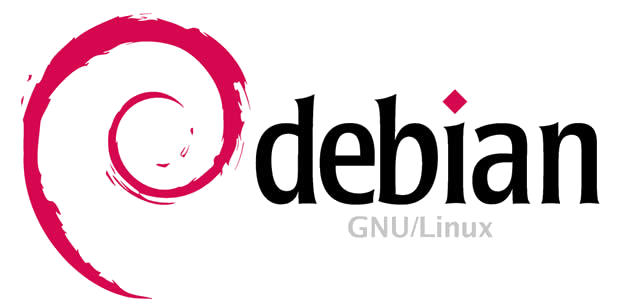
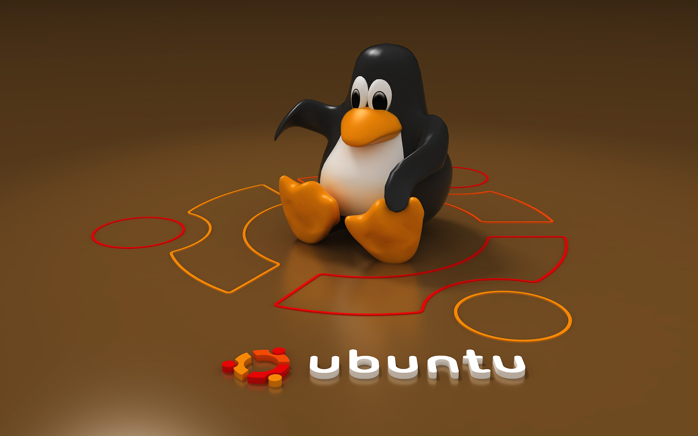
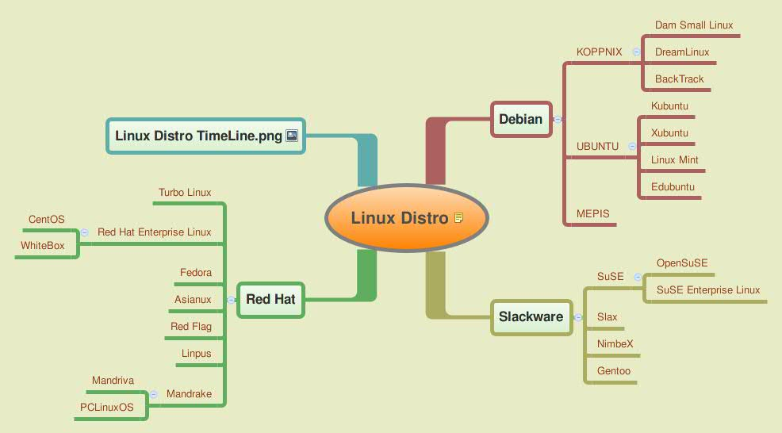

# Linux Distribution

# 1. Khái niệm Linux Distribution

## 1.1 Giới thiệu về Linux Distribution

- **Linux Distribution** là các bản phân phối của linux - là một **hệ điều hành**, chúng đều dựa trên 3 nhánh chính để phát triển, đó là **Debian, Red Hat, Slackware**. Chúng đều có **Linux và Kernel**

  - > Kernel là một chương trình máy tính, có nhiệm vụ quản lý các tài nguyên hệ thống, được khởi chạy trong quá trình khởi động hệ thống (sau bootloader)

- **Thành Phần**: Một bản distro thường bao gồm: một kernel Linux, các công cụ và thư viện GNU.

## 1.2 Loại hình và xu hướng phát triển

Phần lớn tập trung vào mục đích:

    -Thiết kế cho người dùng doanh nghiệp, chuyên nghiệp, hoặc người dùng gia đình.
    -Thiết kế cho máy chủ, hoặc cho các thiết bị nhúng.
    -Sử dụng để phục vụ các chứng năng máy cụ thể (ví dụ: tường lửa, router mạng)

Vì thế nên sẽ chia ra các nhánh để phục vụ cho từng công việc cụ thể

    -Nhóm 1: Dành cho người am hiểu Linux

        -Gồm có: Arch, Gentoo và Slackware
        -Nhóm này phần lớn các phương thức xây dựng, cũng như cách cấu hình hệ thống đều được thực hiện qua các dòng lệnh.

    -Nhóm 2: Dành cho người am hiểu về hệ thống, nhưng chưa thực sự hiểu về Linux

        -Gồm có: Debian, Fedora
        -Nhóm này được cung cấp cho họ nhiều công cụ để tương tác với hệ thống hơn, phù hợp với người bắt đầu sử dụng Linux.
        -Tuy nhiên, nhóm này lại có quy trình phát triển và kiểm tra chất lượng phần mềm khắt khe hơn các nhóm còn lại.

    -Nhóm 3: Dành cho thị trường máy chủ, doanh nghiệp, cơ quan
        -Gồm: CentOS, RHEL, SUSE EL
        -Nhóm này có độ ổn định cao, thời gian ra phiên bản mới lâu, khoảng 3-5 năm tùy distro.

    -Nhóm 4: Dành cho người bắt đầu sử dụng Linux, hoặc người dùng cuối.
        -Gồm: Ubuntu, Open SUSE, Linux Mint
        -Đặc tính của chúng là phát triển trong thời gian ngắn, ứng dụng các công nghệ mới liên tục, nhóm này có GUI thân thiện với người dùng.

# 2. Các nhánh distro phổ biến

- Mặc dù có rất nhiều các distro, nhưng cơ bản đều dựa trên 3 nhánh chính đó là: **Debian, Red Hat, và Slackware**.
- Do Linux nó là một open source nên có thể tùy biến theo ý của mình, miễn là dựa trên các license mà Linux đưa ra.
- Sau một thời gian dài phát triển thì hiện nay, 2 nhánh distro phổ biến là **Debian và Fedora**

## 2.1 Debian

- Là một bản phân phối được ra đời sớm nhất, được phát triển dựa trên sự cộng tác của nhiều tình nguyện viên trên khắp thế giới trong Dự án Debian.

- Có 3 phiên bản khác nhau:

  - Phiên bản ổn định mà người dùng được khuyến khích sử dụng.
  - Phiên bản không ổn định.
  - Phiên bản thử nghiệm cho những ai có mong muốn trải nghiệm phần mềm mới nhất.

- Hệ thống quản lý gói phần mềm sử dụng:

  - `dpkg` cài đặt các gói phần mềm .deb
  - `apt` cài đặt các phần mềm khác từ trên kho

- Có khả nhiều bản dựa trên distro Debian: Raspbian, Knoppix , Kali Linux và phổ biến nhất là **Ubuntu**

### 2.1.1 Ubuntu

- Do công ty Canonical phân phối, chỉ mới xuất hiện vào quý 3/2004 và không lâu sau đó đã trở nên phố biến.

- Dựa trên hệ thống quản lý gói mạnh mẽ từ **APT** của Debian, nhắm đến các đối tượng người dùng đầu cuối, nhỏ gọn chỉ với 1 đĩa cài đặt. Người dùng Ubuntu có thể cảm nhận được sự tự do, tùy biến cao trong sử dụng, quản lý hệ thống.

- Theo thống kê của trang [DistroWatch](https://distrowatch.com/), cho đến nay Ubuntu là distro phổ biến nhất với hơn 2000 lượt truy cập / ngày.

- Cứ 6 tháng, Ubuntu sẽ phát hành bản mới, đối với các bản Long Tem Support (LTS), thì việc cập nhật trình bảo mật sẽ từ 3 đến 5 năm.

- Cách đặt tên của Ubuntu theo định dạng YY.MM, trong đó YY là năm phát hành còn MM là tháng phát hành.

- Ubuntu sử dụng giao diện đồ họa thân thiện GNOME, hướng đến sự đơn giản hóa trong quá trình sử dụng. Ngoài ra còn có OpenOffice, trình duyệt Firefox...

- Ngoài Ubuntu, các nhà phát triển còn tạo ra các distro tương tự Ubuntu như: Kubuntu, Xubuntu, Lubuntu, Linux Mint. Các distro này khác biệt với Ubuntu ở giao diện màn hình.

## 2.2 Fedora

- Là một bản phân phối cộng động. Được tạo ra nhằm kiểm thử các công nghệ cho một bản phân phối thương mại khác của Red Hat - nơi mà các phần mềm nguồn mở được tạo lập, phát triển và kiểm thử trong môi trường cộng đồng trước khi được đưa vào Red Hat Enterprise Linux.

- Tương tự như Ubuntu, chu kỳ ra phiên bản mới cũng là 6 tháng. Phiên bản mới với các tính năng bảo mật mà các chuyên gia đánh giá khá cao.

- Có thể nâng cấp lên phiên bản mới mà không cần cài đặt lại.

- Dùng **yum** để quản lý các gói phần mềm định dạng .rpm và cài đặt phần mềm.

- Fedora có thể dùng cho máy trạm, thậm chí là máy chủ, dành cho những người đã có nhiều kinh nghiệm

- 2 distro phổ biến nhất được phát triển dựa trên Fedora là ** Red Hat Enterprise Linux ** - với đối tượng hướng tới là các doanh nghiệp và công ty lớn (có tính phí), và **CentOS** - free và hướng tới đối tượng là người sử dụng máy tính cá nhân.

## Tổng quan lại: Các distro của Linux được mô tả như hình sau:

# 3. Tài liệu tham khảo

[1] Linux Distribution - Wiki: [https://en.wikipedia.org/wiki/Linux_distribution](https://en.wikipedia.org/wiki/Linux_distribution)

[2] Bản phân phối của Linux - Wiki: [https://vi.wikipedia.org/wiki/B%E1%BA%A3n_ph%C3%A2n_ph%E1%BB%91i_Linux](https://vi.wikipedia.org/wiki/B%E1%BA%A3n_ph%C3%A2n_ph%E1%BB%91i_Linux)

[3] Linux là gì? - [What is Linux?](https://vi.wikipedia.org/wiki/B%E1%BA%A3n_ph%C3%A2n_ph%E1%BB%91i_Linux)

[4] Một số tài liệu về [Debian](https://vi.wikipedia.org/wiki/Debian), [Fedora](https://vi.wikipedia.org/wiki/Fedora), [Red Hat Enterprise Linux](https://en.wikipedia.org/wiki/Red_Hat_Enterprise_Linux), [CentOs](https://wwwcentos.org/about/)
