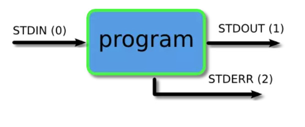
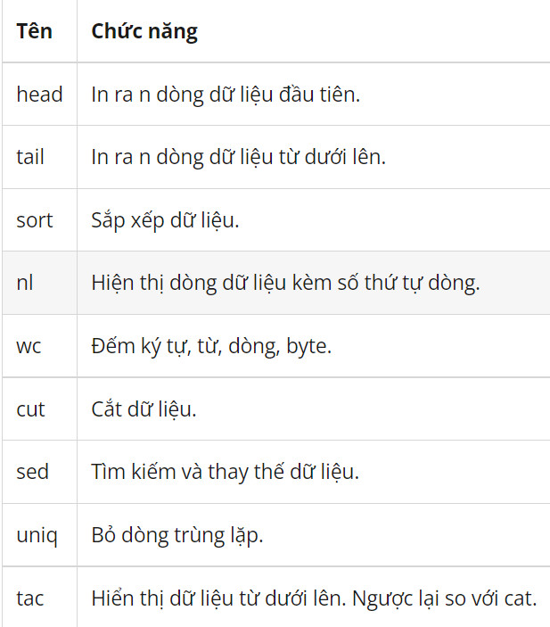

# Linux command
## Work on the command line
### Các khái niệm
* GNU/Linux shell: là 1 chương trình đặc biệt, cung cấp 1 giao diện “prompt”, cho phép người dùng tương  tác với HĐH thông qua các ”text-based commands” (programs.). Linux Command is Case-sensitive.
* Shell:
    * Bash: GNU Bourne Again shell, được phát hành năm 1989 thay thế cho Bourne shell trên Unix. Hiện 
tại là default shell của hầu hết User được tạo trên Linux.
    * Dash: The Debian Almquist shell (Dash) phát hành năm 2002.
    * KornShell: được tạo bởi David Korn tại Bell Labs. 
    * tcsh.
    * Z shell: phát hành năm 1990.

* /bin/sh: từng là nơi cài đặt của Bourne Shell. Hiện tại là “symbolic link” đến các Shell khác.

* Cú pháp chung: command [flags] arg1 arg2 arg3 
    * Các thành phần cách nhau một khoảng trắng. 
    *  Các cờ thường theo sau dấu “-” hoặc “--” (các cờ nhiều ký tự). 
    * Nhiều cờ có thể dùng chung một ký tự “-”. VD: ls -al tương đương ls -a -l
    * Một số lệnh đặc biệt, không cần ký tự “-” trước các cờ.

* Đường dẫn tuyệt đối: bắt đầu bằng “/” ở đầu đường dẫn.
* Đường dẫn tương đối: không bắt đầu bằng “/” ở đầu đường dẫn.
* Đường dẫn đặc biệt:
    * ~ thư mục ”home” của người dùng hiện tại.
    * . là vị trí thư mục đang đứng.
    * .. là thư mục “cha” của vị trí đang đứng

* Tập tin/thư mục ẩn: tên được bắt đầu bằng dấu chấm “.” ví dụ: .bash_history

### Một số câu lệnh 
1. Lệnh ls: Nó cho phép bạn liệt kê nội dung của thư mục bạn muốn (thư mục hiện tại theo mặc định), bao gồm các tệp và các thư mục lồng nhau khác.
1. Lệnh alias: cho phép bạn xác định bí danh tạm thời trong phiên trình bao của bạn. Khi tạo bí danh, bạn hướng dẫn trình bao của mình thay thế một từ bằng một loạt lệnh.
1. Lệnh unlias lệnh này nhằm mục đích xóa một alias bí danh khỏi các bí danh đã được xác định. Để xóa ls bí danh trước đó, bạn có thể sử dụng.
1. Lệnh pwd này là viết tắt của “print working directory” và nó xuất ra đường dẫn tuyệt đối của thư mục mà bạn đang ở.
1. Lệnh cd: chuyển bạn đến thư mục mà bạn đang cố gắng truy nhập
1. Lệnh mkdir: Để tạo các thư mục trong shell, bạn sử dụng mkdirlệnh. Chỉ cần chỉ định tên của thư mục mới, đảm bảo rằng nó không tồn tại và bạn đã sẵn sàng.  
1. Lệnh echo: Lệnh echo hiển thị văn bản đã xác định trong thiết bị đầu cuối - thật đơn giản:
1. Lệnh passwd: passwd cho phép bạn thay đổi mật khẩu của tài khoản người dùng
1. Lệnh grep: Grep là một trong những tiện ích mạnh mẽ nhất để làm việc với các tệp văn bản. Nó tìm kiếm các dòng phù hợp với một biểu thức chính quy.
1. Lệnh whoami: Lệnh whoami(viết tắt của “tôi là ai”) hiển thị tên người dùng hiện đang được sử dụng.
1. Lệnh touch: cho phép bạn cập nhật thời gian truy cập và sửa đổi của các tệp được chỉ định.
1. Lệnh vim: cho phép bạn chỉnh sửa các tệp văn bản thuần túy bằng cách sử dụng keybindings hiệu quả.

* Các biến môi trường – Environment variables:
    * printenv: show toàn bộ hoặc 1 phần các biến môi trường.
    * env: chạy chương trình trong 1 môi trường với các biến tuỳ chỉnh. 
    * set: show các tên/gía trị của Shell. Thay đổi các thuộc tính của Shell.

## Cách sử dụng piping and redirection, filter trong Linux
* Pipe: thực tế pipe có nghĩa là cái ống, là công cụ để cho dòng chảy đi qua. Trong linux pipe có kí hiệu là dấu gạch đứng ( | ). Và nó có tác dụng chuyển dòng chảy dữ liệu (data stream) từ output chương trình này sang input của chương trình ở sau nó A | B - Output (STDOUT) của chương trình A sẽ thành input (STDIN) của chương trình B

* Redirection: dùng để điều hướng data stream giữa 1 chương trình và 1 file. Các ký hiệu của redirection bao gồm: 
1.     > Xuất STDOUT vào file (overwrite) 
2.     >> Xuất STDOUT vào file (append) 
3.     < Đọc STDIN từ file 
4.     2> Xuất STDERR vào file. 

* Luồng dữ liệu        
   

Mọi chương trình linux trên command line đều bao gồm 3 loại data stream: 
1. STDIN(0) - Standard input (dữ liệu đầu vào) 
2. STDOUT(1) - Standard output (dữ liệu đầu ra) 
3. STDERR(2) - Standard error (dữ liệu lỗi đầu ra)  

* Filter trong giới hạn command line là một chương trình có nhiệm vụ nhận dữ liệu đầu vào (STDIN), xử lý và xuất ra kết quả (STDOUT). Các filter phổ biến bao gồm:       
    

## Chỉnh sửa tệp cơ bản - vim
### Cú pháp
    vim <tên file>
### vim modes:
* Command mode: Đây là chế độ dòng lệnh bắt đầu bằng dấu hai chấm :. Đây là chế độ mặc định khi bạn mở Vim editor.Khi đang ở chế độ khác mà bạn muốn quay trở về chế độ command mode thì sử dụng phím Esc (đôi khi phải nhấn 2 lần).

* Insert mode: Chế độ Insert cho phép bạn chèn dữ liệu vào file đang mở. Phím tắt là “i” (chèn văn bản vào vị trí con trỏ) hoặc “o” (chèn văn bản vào đầu dòng).

* Visual mode: Chế độ Visual cho phép người dùng chọn văn bản như sử dụng chuột, nhưng sử dụng bàn phím thay vì dùng chuột. Phím tắt là “V”, rất hữu ích khi bạn muốn copy nhiều dòng dữ liệu.      
   
### vim .swp file:
    * Lưu trữ các thay đổi khi edit file. Khi máy hoặc chương trình vim bị ”crash” có thể phục hồi lại nội dung từ file swp.
    * Ngăn ngừa file bị edit ở nhiều nơi đồng thời.   
### Các lệnh trong vim
1. Lưu file - ":w"
2. Thoát khỏi file mà không lưu - ":q"
3. Lưu và thoát khỏi file - ":wq"
4. Chuyển sang chế độ insert - "i"
5. Chuyển sang chế độ command - ESC
6. Xóa một từ - "dw"
7. Xóa một dòng - "dd"
8. Quay trở lại các bước trước - "u".
# Tài liệu tham khảo
[CMD](https://viblo.asia/p/linux-tips-su-dung-piping-redirection-filters-trong-command-line-maGK7LYBZj2)      
[cmd](https://kinsta.com/blog/linux-commands/#:~:text=A%20Linux%20command%20is%20a,abstraction%20of%20command%2Dline%20programs.)    
[vim](https://quantrimang.com/cach-su-dung-trinh-bien-soan-vim-54249)   
[Vim](https://blog.kdata.vn/cach-su-dung-vim-trong-linux-lenh-vim-trong-linux-8028/)    