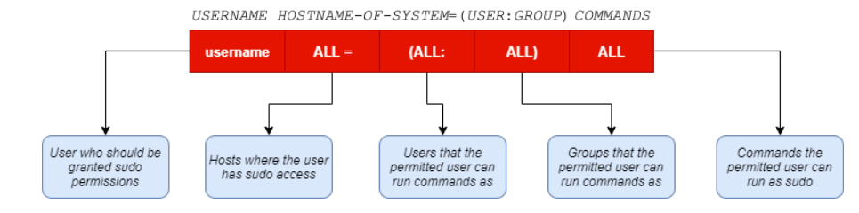

# Linux System 
## Security fundamentals
* Không cho phép account root được login vào hệ thống.
* su – switching the user
* sudo – super user do == root
## Security fundamentals: switching user
* Command: su
*  Ví dụ:
    * su tea login vào account tea
    *  su – tea login vào account tea và thiết lập các biến môi trường giống như account tea lúc login
    * su – login vào account root
    * su –c “command” login vào account root và thực thi command dưới quyền của user root
## Security fundamental: sudo 
* Norepudiation environment: tính không thể chối từ, khi một ai đó thực hiện một việc gì đó
* sudo == Super User do the jobs: cho phép user thực thi một lệnh đơn (single command) với quyền của superuser. Mọi command thực hiện với lệnh sudo đều được ghi log lại, ai làm gì, khi nào 
=> tạo ra tính không thể chối từ của một hành động.
* File cấu hình chính: /etc/sudoers

* Command: visudo – chỉnh sửa file /etc/sudoers
* /etc/sudoers.d/: các file cấu hình cho user hoặc group
* Tránh việc thay đổi nội dung file /etc/sudoers. Việc thay đổi nội dung /etc/sudoers sai cú pháp có thể dẫn đến việc tồi tệ
● Command: visudo – chỉnh sửa file /etc/sudoers /etc/sudoers.d/: các file cấu hình cho user hoặc group
● Tránh việc thay đổi nội dung file /etc/sudoers. Việc thay đổi nội dung /etc/sudoers sai cú pháp có thể dẫn đến việc tồi tệ