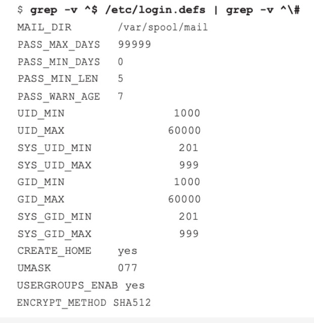
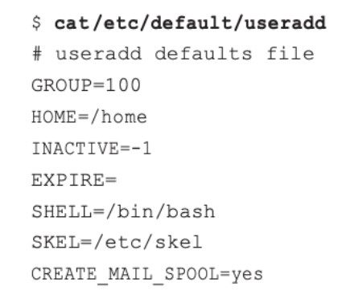

# Linux System 
## Account management
* Users (một account đơn lẻ được tạo ra cho người dùng sử dụng) và Groups (1 nhóm user cùng loại với nhau)
* DAC - discretionary access control: traditional Linux security control, kiểm soát việc truy cập một object bất kì trên Linux dựa trên User identity và group membership.
* Shadow password suite: useradd, userdel, passwd      
     
## Account management: /etc/login.defs
   
* PASS_MAX-DAYS: Số ngày cho đến khi yêu cầu thay đổi mật khẩu. Đây là ngày hết hạn của mật khẩu.
* PASS_MIN_DAYS: Số ngày sau khi thay đổi mật khẩu cho đến khi mật khẩu có thể được thay đổi lại.
* PASS_MIN_LEN: Số kí tự tối thiểu được yêu cầu trong mật khẩu.
* PASS_WARN_AGE: Số ngày cảnh bảo được đưa ra cho người dùng trước khi mật khẩu hết hạn.
* CREATE HOME: Mặc định là không, nếu được đặt thành có, một thư mục chính của người dùng sẽ được tạo.
* ENCRYPT_METHOD: Phương pháp sử dụng hàm băm để băm mật khẩu tài khoản.

## Account management: /etc/default/useradd
     
* HOME: Thư mục cơ sở cho các thư mục tài khoản người dùng
* INACTIVE:Số ngày sau khi tài khoản hết hạn và đã không thay đổi cho đến khi tài khoản sẽ bị vô hiệu hóa.
* SKEL: Khung thư mục
* SHELL: Chương trình shell mặc định của tài khoản người dùng.
## Account management: /etc/skel
* /etc/skel/: thư mục chứa các file mặc định, sẽ được copy vào home directory của user khi user được tạo.
##  Account management: /etc/passwd
* /etc/passwd: chứa thông tin về mỗi account trong hệ thống.
* Mỗi account sẽ được lưu trữ thông tin trên 1 hàng, bao gồm nhiều field, mỗi field cách nhau bởi dấu hai chấm ”:”
* /sbin/nologin: dùng hiển thị các thông tin cần thiết cho người dùng từ /etc/nologin.txt
* /bin/false: thoát hẳn và không hiển thị thông tin

1. User name
1. Password
1. User ID
1. Group ID
1. Comment field
1. Home directory
1. Command Shell
## Account management: /etc/shadow
* /etc/shadow: chứa thông tin về password của user dưới dạng mã hoá
* /etc/shadow: chứa thông tin về password của user dưới dạng mã hoá
* Unix Epoch time: là một con số thể hiện số giây tính tới thời điểm hiện tại, kể từ thời điểm 01/01/1970
* Gồm các trường:
1. User name
1. Pasword
1. Last password change 
1. Minimum
1. Maximum
1. warn
1. Inactive
1. Expire
## Account management: useradd
Tạo user
● useradd –md /home/tea –s /bin/bash tea
##  Account management: passwd
Thay đổi mật khẩu user
* passwd –S coffee: hiển thị trạng thái mật khẩu
* passwd: thay đổi mật khẩu user hiện tại
* passwd coffee: thay đổi mật khẩu user coffee
##  Account management: usermod
Modifying account
* usermod –L coffee: lock tài khoản coffee
* usermod –U coffee: unlock tài khoản coffee
* usermod –s /bin/nologin coffee: set nologin cho user coffee
## Account management: userdel
Delete account
* userdel coffee: xoá tài khoản coffee nhưng vẫn giữ lại home directory, mail directory
* userdel –r coffee: xoá tài khoản coffee hoàn toàn, bao gồm cả các thư mục home, thư mục mail
